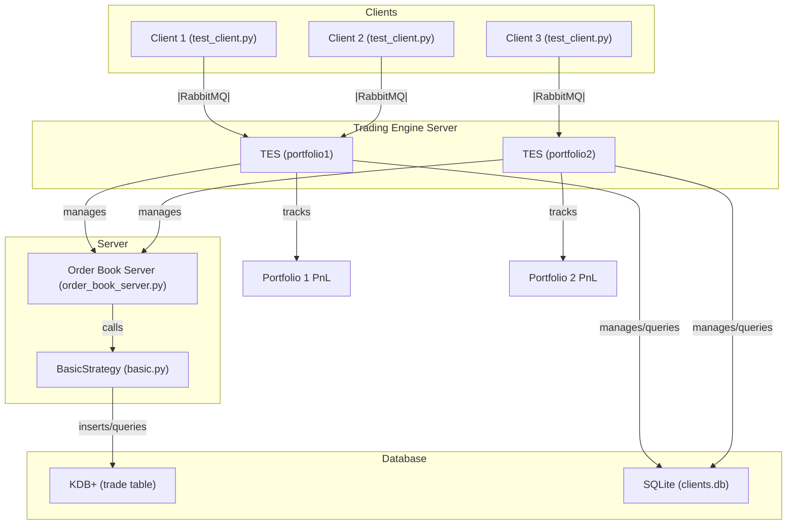

# Python Trading Engine

A modular Python trading engine designed for real-time trading, order management, and analytics. This project is structured for extensibility and clarity, with a Streamlit-based frontend, a robust backend trading engine, and a flexible database layer.

## Project Structure

- **src/frontend/**: Streamlit-based user interface for traders to interact with the system.
- **src/backend/**: Core trading engine logic, including order matching, orderbook management, and PnL calculations.
- **src/database/**: Database integration for storing trades, user data, and market data.

## System Architecture



This diagram shows how clients communicate with the Order Book Server via RabbitMQ, the server uses the strategy for order logic, and the strategy records trades in the KDB+ database.

## Features

- **User Authentication**: Traders can securely log in to the platform.
- **Order Placement**: Place buy/sell orders through the frontend, which are routed to the backend engine.
- **Orderbook Management**: Real-time orderbook with summary, volume, and order matching logic.
- **Trade Matching**: Engine matches orders and executes trades according to market rules.
- **PnL Overview**: Real-time profit and loss breakdown for each trader and the overall system.
- **Database Storage**: All trades, orders, and user data are stored in a database for persistence and analytics.

## Technology Stack

- **Frontend**: [Streamlit](https://streamlit.io/) for rapid UI development and real-time updates.
- **Backend**: Python-based trading engine with modular components for order management, matching, and analytics.
- **Database**:
  - _Market Data_: (Recommended) [kdb+](https://kx.com/) for high-performance, real-time ticker data storage and retrieval.
  - _Trade & User Data_: Alternatives such as PostgreSQL, SQLite, or MongoDB can be used for storing trades, orders, and user information.

## Getting Started

1. **Clone the repository**
   ```sh
   git clone https://github.com/yourusername/py-trading-engine.git
   cd py-trading-engine
   ```
2. **Install dependencies**
   - Backend and frontend Python dependencies (see `requirements.txt`)
   - Database setup as per your chosen backend
3. **Run the frontend**
   ```sh
   streamlit run src/frontend/app.py
   ```
4. **Run the backend**
   ```sh
   python src/backend/main.py
   ```

## Running RabbitMQ (for Order Book Server)

This project uses RabbitMQ for messaging between the order book server and clients.

### Install RabbitMQ (macOS)

```sh
brew install rabbitmq
```

### Start RabbitMQ

```sh
brew services start rabbitmq
```

### Restart RabbitMQ (if needed)

```sh
brew services restart rabbitmq
```

You can check the status with:

```sh
rabbitmqctl status
```

Make sure RabbitMQ is running before starting the order book server or test clients.

## KDB+ Service Requirement

A kdb+ service must be running in the background for the trading engine to record trades and interact with market data. You can start a kdb+ process (for example, on port 8080) with:

```sh
q -p 8080
```

Ensure the `trade` table exists in your kdb+ instance before running the backend server. Example to create a simple trade table in your q session:

```q
trade:([] id:`symbol$(); timestamp:0n; symbol:`symbol$(); quantity:0N; price:0N)
```

## Running the Trading Engine and Clients (Manual Startup)

To run the system, you must have RabbitMQ running for backend messaging. Start the servers and clients in separate terminals as follows:

1. **Start the Order Book Server (OBS):**

   ```sh
   python src/backend/main.py -s OBS
   ```

   This launches the Order Book Server, which must be running before the Trading Engine Server can connect.

2. **Start the Trading Engine Server (TES):**

   ```sh
   python src/backend/main.py -s TES
   ```

   The TES will attempt to connect to the OBS via RabbitMQ. If OBS is not running, TES will log an error and exit.

3. **Start a Trader Client:**
   ```sh
   python src/backend/main.py -c trader
   ```
   This will connect a trader client to the Trading Engine Server.

You can start multiple clients or servers in separate terminals as needed. Make sure RabbitMQ is running before starting any backend servers or clients.

---

## Backend Class Structure

- **TraderClient**: Client class that connects to the Trading Engine Server (TES) and sends trading actions (e.g., connect, buy, sell).
- **TradingEngineServer (TES)**: Handles client registration, portfolio management, and routes trading actions to the order book server.
- **OrderBookServer (OBS)**: Manages the order book, processes order requests, and interacts with trading strategies.
- **Trader**: Represents a trader/user in the system. Handles authentication, user info, and session management.
- **Order**: Represents a trade order (buy/sell) with attributes such as user, symbol, side, quantity, price, status, and timestamps.
- **OrderBook**: Manages all open orders, organizes bids/asks, and provides orderbook summary and volume.
- **Trade**: Represents an executed trade, storing details of matched orders, price, quantity, and involved traders.
- **TradingEngine**: Core engine for order placement, order matching, trade execution, and PnL calculation.
- **PnLCalculator**: Calculates real-time and historical profit and loss for each trader and the overall system.
- **DatabaseManager**: Handles all interactions with the SQLite database (and future kdb+ integration for market data).
- **MarketDataFeed**: (Planned) Interface for real-time ticker/market data, with future support for kdb+.

This structure is designed for modularity and extensibility, allowing for easy addition of new features and components as the trading engine evolves.

## Contributing

Contributions are welcome! Please open issues or submit pull requests for new features, bug fixes, or improvements.

## License

This project is licensed under the MIT License.
