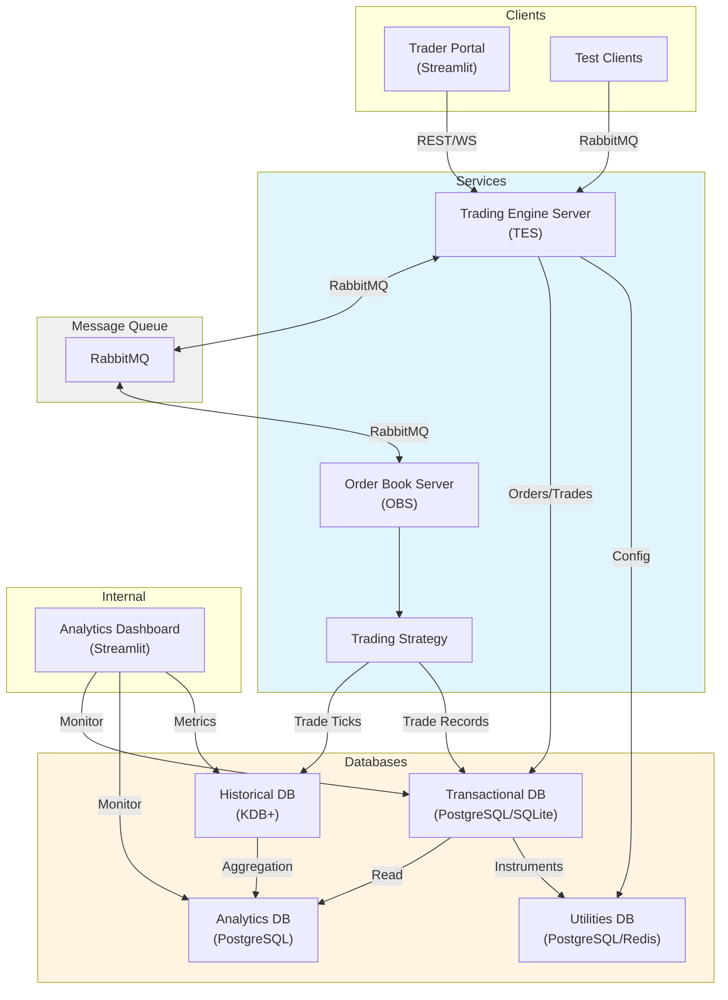

# Python Trading Engine

A modular, microservices-based Python trading system designed for real-time trading, order management, and analytics. Built with a service-oriented architecture using RabbitMQ for inter-service communication, multiple specialized databases, and both trader-facing and internal analytics frontends.

✨ **New:** Enhanced CLI with [Typer](https://typer.tiangolo.com/) and [Rich](https://rich.readthedocs.io/) for beautiful terminal output! See [CLI Guide](docs/CLI_GUIDE.md) for details.

## Project Structure

```
py-trading-engine/
├── src/
│   ├── servers/           # Trading servers (TES, OBS)
│   ├── database/          # Multi-database layer
│   │   ├── transactional/ # ACID operational database
│   │   ├── historical/    # KDB+ time-series data
│   │   ├── analytics/     # Aggregated metrics
│   │   └── utilities/     # Reference data
│   ├── frontend/          # User interfaces
│   │   ├── trader-portal/ # External trader UI
│   │   └── analytics/     # Internal analytics dashboard
│   ├── messaging/         # RabbitMQ abstraction layer
│   ├── shared/            # Common utilities and models
│   └── clients/           # Test clients
├── tests/                 # Test suite
├── config/                # Configuration files
├── docker/                # Docker configurations
├── scripts/               # Utility scripts
├── requirements/          # Python dependencies
└── main.py               # Main entry point
```

## Architecture

The system follows a microservices architecture with separated concerns:

- **TES (Trading Engine Server)**: Client management, portfolio tracking, order routing
- **OBS (Order Book Server)**: Order book management, matching engine, strategy execution
- **Message Queue**: RabbitMQ for asynchronous inter-service communication
- **Database Layer**: Specialized databases for different workloads
  - Transactional: SQLite/PostgreSQL for ACID operations
  - Historical: KDB+ for time-series tick data
  - Analytics: Pre-aggregated metrics and reports
  - Utilities: Configuration and reference data
- **Frontends**: Separate UIs for traders and internal analytics

## System Architecture



**Data Flow:**

1. Traders place orders via Portal or API → TES
2. TES routes orders to OBS via RabbitMQ
3. OBS matches orders using trading strategies
4. Trades recorded in both Transactional DB and KDB+
5. Historical data aggregated into Analytics DB
6. Both frontends access appropriate databases

## Core Features

### Trading Capabilities

- ✅ Order placement (market, limit)
- ✅ Real-time order matching engine
- ✅ Price-time priority matching
- ✅ Multi-user portfolio management
- ⏳ Advanced order types (stop, iceberg, etc.)
- ⏳ Risk management and position limits

### Data Management

- ✅ Multiple specialized databases
- ✅ Real-time trade recording
- ✅ Historical tick data storage
- ✅ Performance analytics aggregation
- ⏳ Data archival and retention policies
- ⏳ Change Data Capture (CDC) streaming

### User Interfaces

- ✅ Trader portal for order entry
- ✅ Real-time position tracking
- ✅ Internal analytics dashboard
- ✅ System health monitoring
- ⏳ WebSocket real-time updates
- ⏳ Mobile responsive design

### Messaging & Communication

- ✅ RabbitMQ message queue
- ✅ RPC pattern for sync operations
- ✅ Async order processing
- ⏳ Event sourcing
- ⏳ Distributed tracing

## Technology Stack

| Component            | Technology                  | Purpose                        |
| -------------------- | --------------------------- | ------------------------------ |
| **Servers**          | Python, FastAPI (planned)   | Trading engine services        |
| **Message Queue**    | RabbitMQ                    | Inter-service communication    |
| **Transactional DB** | SQLite/PostgreSQL           | ACID-compliant operations      |
| **Historical DB**    | KDB+/q                      | Time-series tick data          |
| **Analytics DB**     | PostgreSQL + TimescaleDB    | Aggregated metrics             |
| **Utilities DB**     | PostgreSQL/Redis            | Configuration & reference data |
| **Frontend**         | Streamlit → React (planned) | User interfaces                |
| **Containerization** | Docker, Docker Compose      | Development & deployment       |
| **Orchestration**    | Kubernetes (planned)        | Production deployment          |

## Quick Start

### Prerequisites

- Python 3.9+
- RabbitMQ
- KDB+/q (optional, for historical data)
- Docker (optional)

### Installation

1. **Clone the repository**

   ```bash
   git clone https://github.com/mgale694/py-trading-engine.git
   cd py-trading-engine
   ```

2. **Install dependencies**

   ```bash
   pip install -r requirements/base.txt
   ```

3. **Start RabbitMQ**

   ```bash
   brew services start rabbitmq  # macOS
   # or
   docker run -d -p 5672:5672 -p 15672:15672 rabbitmq:3-management
   ```

4. **Start KDB+ (optional)**

   ```bash
   q src/database/historical/schemas.q -p 8080
   ```

5. **Initialize databases**
   ```bash
   python src/database/transactional/manager.py
   python src/database/analytics/aggregations.py
   python src/database/utilities/model_params.py
   ```

### Running the System

**Terminal 1: Start Order Book Server**

```bash
python main.py server OBS
```

**Terminal 2: Start Trading Engine Server**

```bash
python main.py server TES
```

**Terminal 3: Start Trader Portal**

```bash
python main.py frontend trader
# or directly:
streamlit run src/frontend/trader-portal/app.py
```

**Terminal 4: Start Test Client (optional)**

```bash
python main.py client trader
```

**Analytics Dashboard (optional)**

```bash
python main.py frontend analytics
```

> **Note:** The CLI now uses clear subcommands instead of flags. See [CLI Guide](docs/CLI_GUIDE.md) for the full command reference.

### Verify Installation

1. Check RabbitMQ Management UI: http://localhost:15672 (guest/guest)
2. Check Trader Portal: http://localhost:8501
3. Check Analytics Dashboard: http://localhost:8502

## Development Mode 🚀

For rapid development and testing, use **Development Mode** with automated mock data and simulated traders.

### 🎯 Quick Dev Setup (One Command)

```bash
./scripts/setup_dev.sh
```

This automatically:

- Initializes all databases
- Loads mock data (20 users, 100 orders, 50 trades, 10 instruments)
- Verifies RabbitMQ and KDB+ are running
- Provides next steps

### 📊 Mock Data Generator

Populate databases with realistic test data:

```bash
python main.py --init-mock-data
```

**What gets created:**

- **20 test users** with realistic usernames and starting balances
- **100 historical orders** across 10 symbols (AAPL, GOOGL, MSFT, TSLA, etc.)
- **50 executed trades** with realistic pricing
- **10 trading instruments** with price ranges
- **40-60 positions** distributed across users
- **Analytics data** including PnL and performance metrics

### 🤖 Simulated Traders

Run automated trading bots that place random orders:

```bash
# Start 5 simulated traders
python main.py --simulated-traders 5

# Start 10 traders
python main.py --simulated-traders 10
```

**Simulated traders automatically:**

- Connect to TES via RabbitMQ (like real clients)
- Place random buy/sell orders every ~5 seconds
- Trade across dev symbols (AAPL, GOOGL, MSFT, TSLA, AMZN)
- Print statistics every 30 seconds
- Run continuously until stopped (Ctrl+C)

**Example output:**

```
===========================================================
SIMULATED TRADERS STATISTICS
===========================================================
SimTrader_1     🟢 Running    Orders: 45    Responses: 45
SimTrader_2     🟢 Running    Orders: 43    Responses: 43
SimTrader_3     🟢 Running    Orders: 47    Responses: 47
-----------------------------------------------------------
TOTAL           Active: 3     Orders: 135   Responses: 135
===========================================================
```

### 🧪 Full System Test with Simulated Load

```bash
# Terminal 1: Order Book Server
python main.py -s OBS

# Terminal 2: Trading Engine Server
python main.py -s TES

# Terminal 3: Simulated Traders (5 automated bots)
python main.py --simulated-traders 5

# Terminal 4: Analytics Dashboard (monitor activity)
python main.py --frontend analytics
```

Watch orders flow through the system in real-time! 📈

### ⚙️ Dev Configuration

Development features are controlled by `config/dev.yaml`:

```yaml
dev:
  initialize_mock_data: true # Auto-load mock data
  enable_simulated_traders: true # Allow simulated traders
  mock_data:
    num_users: 20 # Number of test users
    num_orders: 100 # Historical orders
    num_trades: 50 # Executed trades
  simulated_traders:
    count: 5 # Default trader count
    trade_frequency: 5.0 # Seconds between trades
    symbols: # Symbols to trade
      - AAPL
      - GOOGL
      - MSFT
      - TSLA
      - AMZN
```

**Note:** Production environment (`config/prod.yaml`) disables all dev features automatically.

### 📚 Complete Dev Mode Documentation

For detailed information on mock data generation, simulated traders, customization, troubleshooting, and workflows:

👉 **[DEV_MODE.md](docs/DEV_MODE.md)** - Complete development mode guide

### 🔄 Reset Development Environment

```bash
# Delete databases
rm src/database/transactional/trading_engine.db
rm src/database/analytics/analytics.db
rm src/database/utilities/utilities.db

# Reinitialize with fresh data
./scripts/setup_dev.sh
```

## Development

### Documentation

Comprehensive documentation is available in the [docs/](docs/) directory:

- **[Quick Start Guide](docs/QUICKSTART.md)** - Get running in 5 minutes
- **[Development Mode](docs/DEV_MODE.md)** - Mock data and simulated traders
- **[CLI Guide](docs/CLI_GUIDE.md)** - Complete command reference
- **[Migration Guide](docs/MIGRATION.md)** - Migrating from old structure
- **[Implementation Summary](docs/IMPLEMENTATION_SUMMARY.md)** - Architecture details

### Project Organization

Each major component has its own README with detailed documentation:

- [Servers](src/servers/README.md) - TES and OBS implementation
- [Database](src/database/README.md) - Multi-database architecture
- [Frontend](src/frontend/README.md) - User interfaces
- [Messaging](src/messaging/README.md) - RabbitMQ layer
- [Shared](src/shared/README.md) - Common utilities

### Key Components

**Trading Engine Server (TES)**

- Client connection management
- Portfolio and position tracking
- Order routing to OBS
- Trade confirmations

**Order Book Server (OBS)**

- Order book maintenance
- Order matching engine (price-time priority)
- Trading strategy execution
- Trade recording

**Databases**

- **Transactional**: Orders, trades, users, portfolios
- **Historical**: Tick-by-tick trade and quote data
- **Analytics**: Aggregated metrics and reports
- **Utilities**: Configuration and reference data

**Messaging Layer**

- RabbitMQ abstraction
- Publishers and consumers
- RPC pattern support
- Message schemas

**Shared Models**

- Order: Domain model for orders
- Trade: Domain model for executed trades
- Trader: User/trader representation

### Running Tests

```bash
# Unit tests
pytest tests/unit

# Integration tests
pytest tests/integration

# E2E tests
pytest tests/e2e

# All tests with coverage
pytest --cov=src tests/
```

### Code Quality

```bash
# Linting
flake8 src/

# Type checking
mypy src/

# Format code
black src/
```

## Configuration

Configuration files are stored in `config/` directory:

```yaml
# config/dev.yaml
rabbitmq:
  host: localhost
  port: 5672

kdb:
  host: localhost
  port: 8080

database:
  transactional: src/database/transactional/trading_engine.db
  analytics: src/database/analytics/analytics.db
```

Override with environment variables:

```bash
export RABBITMQ_HOST=rabbitmq.example.com
export KDB_PORT=8888
```

## Docker Deployment

```bash
# Build and start all services
docker-compose up -d

# View logs
docker-compose logs -f

# Stop services
docker-compose down
```

## Roadmap

### Phase 1: Core Infrastructure ✅

- [x] Multi-database architecture
- [x] RabbitMQ messaging layer
- [x] Basic order matching
- [x] Trader and analytics portals

### Phase 2: Enhanced Trading (In Progress)

- [ ] FastAPI REST APIs
- [ ] WebSocket real-time updates
- [ ] Advanced order types
- [ ] Risk management engine
- [ ] Position limits and checks

### Phase 3: Production Readiness

- [ ] Authentication and authorization
- [ ] Distributed tracing
- [ ] Comprehensive monitoring
- [ ] Load testing and optimization
- [ ] Kubernetes deployment

### Phase 4: Advanced Features

- [ ] Market data feeds integration
- [ ] Algorithmic trading strategies
- [ ] Backtesting framework
- [ ] Machine learning integration
- [ ] Multi-exchange support

## Performance Considerations

- **Order Matching**: < 1ms latency for order matching
- **Message Queue**: RabbitMQ handles 10k+ msgs/sec
- **KDB+**: Millions of ticks per second
- **Database**: Connection pooling for high throughput
- **Horizontal Scaling**: Multiple TES/OBS instances

## Troubleshooting

### RabbitMQ Connection Issues

```bash
# Check RabbitMQ status
rabbitmqctl status

# Check queues
rabbitmqctl list_queues
```

### KDB+ Connection Issues

```bash
# Test KDB+ connection
echo "tables[]" | q localhost:8080
```

### Database Issues

```bash
# Reinitialize databases
python src/database/transactional/manager.py
```

## Contributing

Contributions are welcome! Please:

1. Fork the repository
2. Create a feature branch
3. Write tests for new features
4. Ensure all tests pass
5. Submit a pull request

## License

This project is licensed under the MIT License - see the [LICENSE](LICENSE) file for details.

## Acknowledgments

- KDB+/q for high-performance time-series database
- RabbitMQ for reliable message queuing
- Streamlit for rapid UI development

## Contact

- GitHub: [@mgale694](https://github.com/mgale694)
- Repository: [py-trading-engine](https://github.com/mgale694/py-trading-engine)
